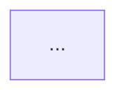

# 产出文件模板

第 5 步落盘时照这个写。模板是骨架不是枷锁——材料不适合某一节就删掉那节，别留空标题。

---

## README.md

```markdown
# <材料标题>

<作者/讲者> · <类型：演讲/论文/长文/播客> · <时长或篇幅> · <日期>
原始链接/文件：<...>

读它的目的：<第 0 步用户说的>
处理档位：<A 快通道 / B 标准 / C 深读>  ·  笔记生成于 <YYYY-MM-DD>

## 三条最该记住的

1. <完整的句子，不是关键词。带上"所以怎样"。>
2. ...
3. ...

## 导航

- [证据层](evidence.md) —— <N> 条原文摘录，带定位标记
- [结构笔记](notes.md) —— <N> 条主框架 + <N> 个论证单元，含论证强度评级
- [张力图](tension.md) —— <N> 条张力边、<N> 条冲突边
- [未完成](open.md) —— 待验证的事实、没想清的问题、自测题卡

## 一句话总评

<这材料值不值得别人也读？读之前需要什么背景？>
```

---

## evidence.md

```markdown
# 证据层：<材料标题>

定位标记形式：<时间戳 / 页码 / 段落序号>
说明：引用为作者原话；`⚠️` 开头的行是笔记者的判断，不是原文。

---

E1 [CLAIM · 02:15] "……"

E2 [DATA · 03:40] ……
⚠️ 无来源，L2-3 整段依赖它

E3 [EXAMPLE · 05:12] ……
```

---

## notes.md

```markdown
# 结构笔记：<材料标题>

> 本笔记按<演化/论证/主题>轴重组，与原文顺序不同。

## L1 主框架

1. <一句话>
2. ...

（3–7 条）

---

## L2 论证单元

### L2-1 <论点标题>

<2–4 句展开>

支撑：E3、E7、E12
强度：**强 / 中 / 弱** —— <一句话说明为什么给这个评级>
判断：<可选。只在发现作者没说的东西时写。>
```

---

## tension.md

~~~markdown
# 张力图：<材料标题>



图例：实线 = 主干关系，虚线 = 内部张力，粗线 = 与外部认知冲突

---

## 张力 1：<一句话概括>

<具体是什么，涉及哪些证据编号>

对你的意义：<关联第 0 步的目的，给出可操作的推论>

## 冲突 1：<一句话概括>

材料说：<...>（E-n）
但：<外部来源或用户经验>（来源：<...>）
怎么看：<...>
~~~

---

## open.md

```markdown
# 未完成：<材料标题>

## 待验证的事实

- [ ] E8 的成本数字无来源，需查 <具体去哪查>
- [ ] ...

## 没想清的问题

- <材料没回答、我也没想明白的>
- ...

## 行动项 / 触发条件

- <具体到能判断做没做的行动>
- 触发条件：等 <条件> 时，回来看 tension.md 第 2 条

## 自测题卡

**Q1.** <问机制的题>
**Q2.** ...

<details>
<summary>答案</summary>

**A1.** <...>（E7、E12）

</details>
```
