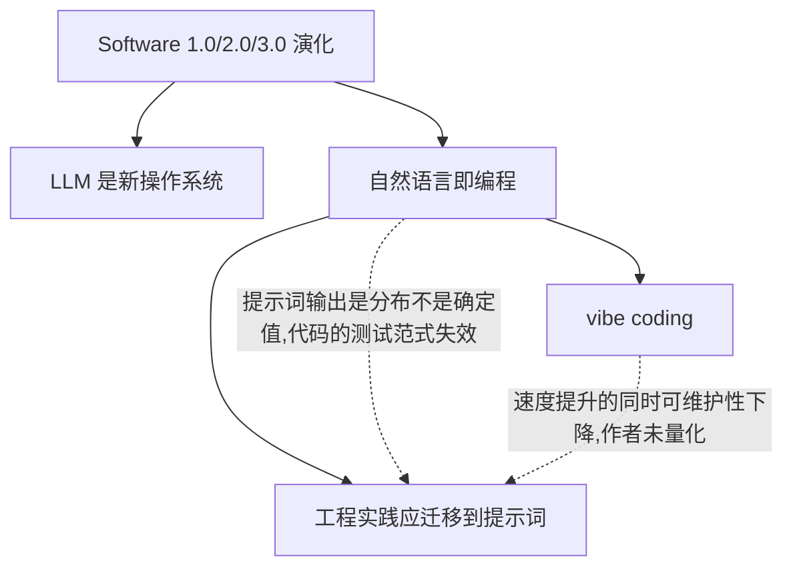

# 张力图谱：怎么画才有用

SKILL.md 第 3 步的展开。读这份文件的时机：正要画图，或者找不出张力边。

## 为什么不画全景概念图

常规做法是把所有关键概念画成节点、用"层级/因果/支撑"连起来。这么做的问题是：这些关系在 notes.md 的 L1/L2 结构里**已经完整表达了**，画成图只是换个排版，信息增量接近零。而且节点一多就没人看得下去。

图的独特价值在于表达**非树状的关系**——线性文字最难承载的那种：A 和 B 同时成立会互相拆台、C 只在 D 前提下成立、作者第 3 节的主张和第 7 节自相矛盾。这些东西在提纲里会被章节顺序打散，在图里一眼可见。

所以：**骨架尽量少，把画布留给张力。**

## 三类边

### 骨架边 `-->`

只连 L1 之间的主干关系。目的是把图撑成一个连通的结构，让张力边有地方挂。5–8 条封顶。

### 张力边 `-.张力.->`

材料**内部**的紧张关系。四种典型来源，按出现频率排：

1. **未处理的取舍**：作者主张 A 也主张 B，但 A 和 B 争夺同一种资源（时间、可靠性、可解释性）
2. **隐含前提**：某个结论只在某条件下成立，作者没说这个条件
3. **类比的断裂点**：作者用类比论证（"提示词就像代码"），但类比在某个维度上失效
4. **作者自己承认的例外**：「当然，这在 X 场景下不适用」——这句常被摘要丢掉，其实是最诚实的一条

标签写成**具体的一句话**，不是"张力"两个字：

```
L1_3 -.提示词无确定输出,代码测试范式失效.-> L1_5
```

### 冲突边 `==冲突==>`

材料**外部**的冲突：与用户已有认知（第 0 步问出来的）、与其他来源、与用户的实际经验相左。

这类边最有价值也最少，一份材料能有 1–2 条就不错。没有不要硬凑——把外部知识硬塞进图里会让用户分不清哪些是材料说的、哪些是你加的。凡是冲突边，节点上必须标出外部来源。

## 硬约束

### 节点 ≤ 15

超过就失去了"一眼扫完"的唯一优势。超了怎么办：

- 先删。能在 notes.md 里查到的细节节点全删——图不负责完整性。
- 还超就**分层**：一张主干图（L1 级，≤8 节点）+ 若干局部图（每个 L1 展开成一张，≤10 节点）。局部图只画有张力的那几个 L1，平铺直叙的不用展开。

### 至少 2 条张力边或冲突边

找不到时，按顺序试这四个问题（不是每个都有答案，找到 2 条就停）：

1. 作者最强的那个主张，**在什么情况下会失败**？他处理了吗？
2. 作者用了哪些类比？类比在哪个维度上不成立？
3. 材料里有没有"当然""不过""需要注意"引出的让步？那后面通常是被轻描淡写的真问题。
4. 如果一个持相反立场的聪明人读了这份材料，他会攻击哪一点？

四个都问完还是空的 → 材料可能确实是平铺直叙的教程/说明型。**直说，跳过这一步**，不要为了交差编张力。但要在 tension.md 里写一行"未发现显著张力，理由：X"，让用户知道你找过了。

## Mermaid 写法

用 `flowchart TD`（自上而下）。节点 ID 用 `L1_n` / `C_n` 这种可追溯到笔记的编号，显示文字放方括号里。



几个实用点：

- **边标签里不要用中文引号、括号、`|`**，Mermaid 解析会炸。用逗号和顿号。
- 节点文字超过 20 字就换成短标签，长解释放到图下面的文字说明里。
- 外部来源的节点（冲突边的另一端）用 `classDef` 加虚线边框区分，视觉上一眼分得清"材料里的"和"材料外的"。
- 画完**自己在脑子里跑一遍语法**；渲染失败的图等于没画。不确定就简化。

## 图之外的文字说明

`tension.md` 不能只有一张图。每条张力边和冲突边下面配 2–4 句：这条张力具体是什么、涉及哪些证据编号、它对用户第 0 步说的那个目的意味着什么。

```markdown
### 张力 1：提示词工程化 vs 输出的不确定性

作者主张把代码的工程实践搬到提示词上（L2-4，证据 E7/E12/E15），但代码测试
依赖"同输入同输出"，提示词不满足这条。作者演示的回归测试用例（E15）只有 3 个，
没有讨论怎么处理输出漂移。

对你的意义：你要做的提示词仓库，版本控制那部分可以直接抄，测试那部分需要
另找方案（评估集 + 通过率阈值，而不是断言相等）。
```

**最后这一句是整张图的落点。**图本身只是把问题摆出来，用户要的是"所以我该怎么办"。
